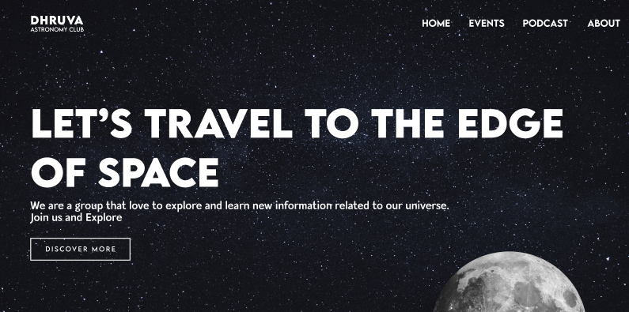

# DHRUVA Astronomy Club Website

The official website for **DHRUVA**, the Astronomy Club. This project is a modern, responsive web application built to showcase the club's events, podcasts, team members, and cosmic explorations.



## 🚀 Project Overview

The DHRUVA website serves as a digital portal to the cosmos for students and astronomy enthusiasts. It features a premium, dark-themed aesthetic inspired by space, utilizing smooth animations and interactive elements to create an immersive user experience.

### Key Features

-   **Immersive Hero Section:** An engaging landing page with 3D-style moon animations and starry backgrounds.
-   **Events Carousel:** A dynamic 3D coverflow swiper showcasing past and upcoming events.
-   **Interactive UI:** Built with `Framer Motion` for smooth page transitions and scroll animations.
-   **Podcast Section:** A dedicated space for the club's astronomical podcasts.
-   **Responsive Design:** Fully optimized for mobile, tablet, and desktop viewing.
-   **Modern Styling:** Utilizes Tailwind CSS v4 for a sleek, glassmorphism-based design system.

## 🛠️ Tech Stack

This project is built using the latest web technologies to ensure performance and scalability.

-   **Framework:** [React 19](https://react.dev/)
-   **Build Tool:** [Vite](https://vitejs.dev/)
-   **Language:** [TypeScript](https://www.typescriptlang.org/)
-   **Styling:** [Tailwind CSS v4](https://tailwindcss.com/)
-   **Animations:** [Framer Motion](https://www.framer.com/motion/)
-   **Routing:** [React Router DOM](https://reactrouter.com/)
-   **Carousel:** [Swiper.js](https://swiperjs.com/)

## 🏁 Getting Started

Follow these instructions to set up the project locally on your machine.

### Prerequisites

Ensure you have the following installed:

-   [Node.js](https://nodejs.org/) (Latest LTS version recommended)
-   npm (comes with Node.js)

### Installation

1.  **Clone the repository:**
    ```bash
    git clone git@github.com:P0SSIBLE-0/dhruva-club.git
    cd dhruva-club
    ```

2.  **Install dependencies:**
    ```bash
    npm install
    ```

### 🏃‍♂️ Running the Server

Start the development server with Hot Module Replacement (HMR):

```bash
npm run dev
```

Open your browser and navigate to `http://localhost:5173` (or the port shown in your terminal).

### 🏗️ Building for Production

To create an optimized production build:

```bash
npm run build
```

You can preview the production build locally using:

```bash
npm run preview
```

## 📂 Project Structure

```bash
src/
├── assets/         # Static assets like images and styles
├── components/     # Reusable UI components (Navbar, Hero, Carousel, etc.)
├── pages/          # Page views (Home, About, Event, Podcast)
├── App.tsx         # Main application component & Routing setup
├── main.tsx        # Entry point
└── index.css       # Global styles & Tailwind directives